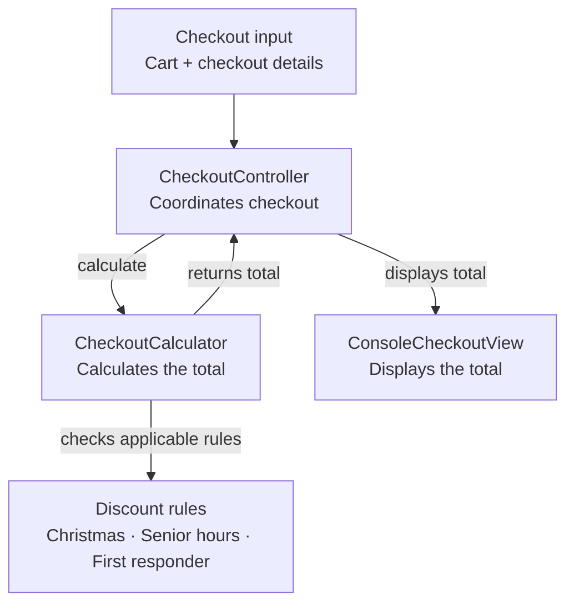
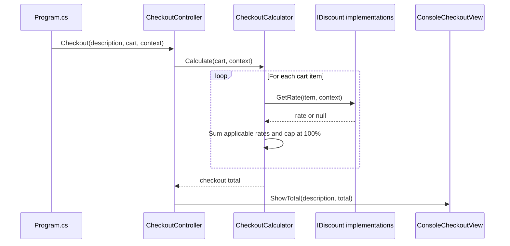

# Technical Overview

## Purpose

This project is a small .NET 10 console application for calculating grocery checkout totals. Its main design goal is to keep discount policies independent from the total-calculation algorithm, so a new discount can be added without adding another category-specific branch to the engine.

This is an educational sample, not a complete point-of-sale system. For example, it does not validate product prices or quantities, persist orders, or define a production rounding and tax policy.

## Design rationale

I kept the solution intentionally lightweight. The prompt identifies discount rules as the most likely source of change, so I introduced an `IDiscount` policy boundary at that point. The solution separates product data, cart selection, checkout context, calculation, and console presentation. It intentionally avoids persistence, web frameworks, and a dependency-injection container because they would not improve this in-memory console exercise. The unit tests focus on the original business-rule boundaries and the

policy-composition behavior introduced by the refactor.

## Architecture



Read the diagram from top to bottom: checkout data enters the controller, the calculator calculates each item using the applicable discount rules, and the controller sends the result to the console view. `Program.cs` creates and connects these objects. Each rule implements `IDiscount`; the controller uses `ConsoleCheckoutView` directly. Dependency wiring is explicit, with no DI container.

## Checkout Flow



## Design Concepts

### Models

The model types describe checkout data and do not perform output:

*   `Product` contains a name, category, and unit price.
*   `ProductCategory` classifies products as `Other`, `Christmas`, or `Food`.
*   `CartItem` associates a product with a quantity or weight. Its subtotal is `Product.UnitPrice * (Weight ?? Quantity)`, so weight takes precedence when it is present.
*   `CheckoutContext` supplies the checkout date/time and whether the customer is a first responder.

The current model does not validate values. It permits, for example, negative prices and an item that has both quantity and weight. If both are supplied, weight is used.

### Discount Strategy and Interface

`IDiscount` is the contract for one discount policy:

```csharp
decimal? GetRate(CartItem item, CheckoutContext context);
```

An implementation returns a decimal rate when it applies, such as `0.20m` for 20%, or `null` when it does not apply. The `m` suffix makes the literal a `decimal`, which is suitable for financial calculations. This design is an example of the Strategy pattern: the engine invokes a common contract while the concrete rule supplies the policy.

The existing strategies are:

*   `ChristmasDiscount`: applies only to Christmas-category products in December. Days 1-14 receive 20%, days 15-25 receive 60%, and days 26-31 receive 90%.
*   `SeniorHoursDiscount`: applies 10% to Food-category products from 7:00 AM inclusive to 9:00 AM exclusive.
*   `FirstResponderDiscount`: applies 10% to every item when `CheckoutContext.IsFirstResponder` is true.

### Calculation and Stacking

For each item, `CheckoutCalculator` adds the rates of all discounts that apply. For example, on a $100 item:

- 10% off is $10.
- 20% off is $20.
- Together, that is $30 off, so the item costs $70.

Both discounts are calculated from the original $100 price, not one after another. The combined discount is capped at 100% per item, so the item cannot cost less than $0. This is the current business policy; changing how discounts combine should include corresponding test updates. The engine does not validate negative discount rates or round item and checkout totals.

### Controller and View

`CheckoutController` receives a `CheckoutCalculator` and a `ConsoleCheckoutView` through its constructor. It coordinates the operation: calculate a total, then ask the view to display it. The controller is directly coupled to the console view; no view interface is used.

This is a lightweight MVC-style separation, not a full web MVC application. The controller coordinates, the models hold checkout data, and the console view handles presentation. Directly using `ConsoleCheckoutView` keeps this small console application simple, but another presentation would require changing the controller or adding an abstraction.

### Manual Dependency Injection

Dependencies are provided through constructors rather than created inside the consuming classes. `Program.cs` acts as the composition root: it selects discount implementations and creates the calculator, controller, and console view. The calculator and concrete view are passed to the controller. Adding a DI framework is not necessary for this application; constructor injection remains useful without one.

## Adding a Discount

1. Add a class that implements IDiscount and return null when the rule does not apply.
2. Add an instance of the class to the discounts array in Program.cs.
3. Add tests for applicability, boundaries, and interaction with other discounts.

For example, a simple food promotion could be implemented as:

```csharp
public sealed class FoodPromotionDiscount : IDiscount
{
    public decimal? GetRate(CartItem item, CheckoutContext context) =>
        item.Product.Category == ProductCategory.Food ? 0.05m : null;
}
```

The `CheckoutCalculator` does not need a new type-specific branch. If a new policy needs input that does not exist in `CheckoutContext` or the models, extend the relevant model deliberately and test the new behavior.

## Tests

Run the tests from the repository root:

```sh
dotnet test ShoppingChallenge.Tests/ShoppingChallenge.Tests.csproj
```

`ShoppingChallenge.Tests/CheckoutDiscountTests.cs` covers Christmas date boundaries, senior-hour boundaries and category restrictions, first-responder eligibility, additive stacking, the 100% cap, and quantity- versus weight-based subtotals. These tests characterize the current policy; changing policy should include corresponding test updates.

## Source Map

*   `ShoppingChallenge/Models`: checkout and product data.
*   `ShoppingChallenge/Discounts`: discount contract and strategies.
*   `ShoppingChallenge/Services`: calculation engine.
*   `ShoppingChallenge/Controllers`: checkout orchestration.
*   `ShoppingChallenge/Views`: console output implementation.
*   `ShoppingChallenge/Program.cs`: sample data and dependency composition.
*   `ShoppingChallenge.Tests`: automated tests.

## Production considerations

Operational logging and monitoring are intentionally outside the scope of this in-memory console exercise. In a production checkout service, I would emit structured logs and metrics for checkout outcomes, discount-policy application, discount rates, calculation failures, and latency. Logs would avoid sensitive customer information and include a correlation or checkout identifier.